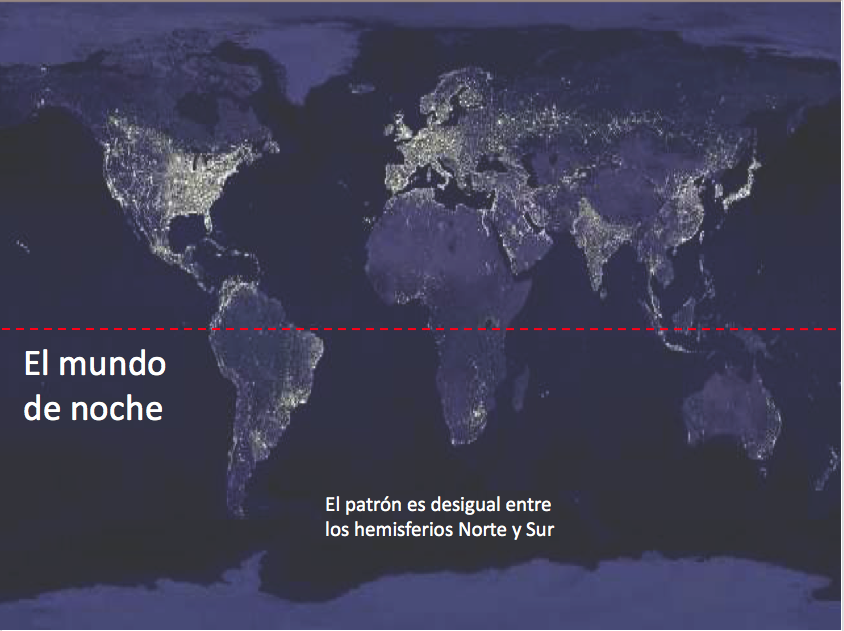
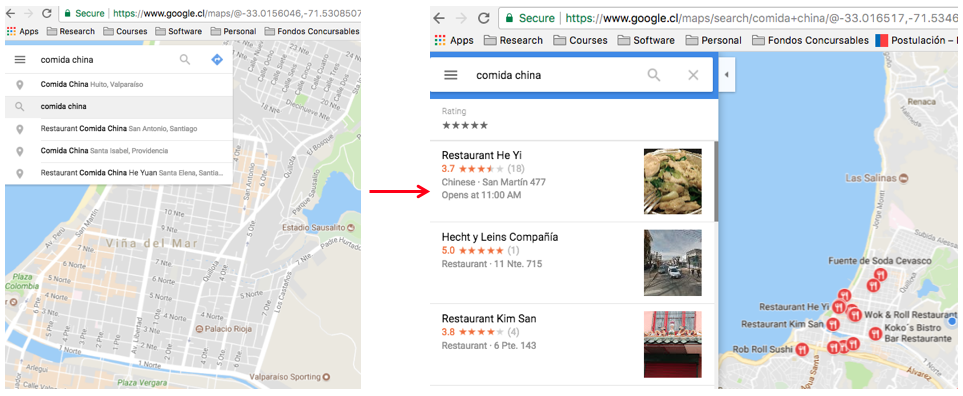
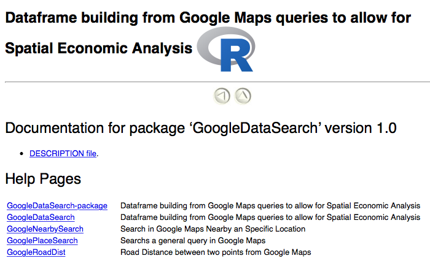
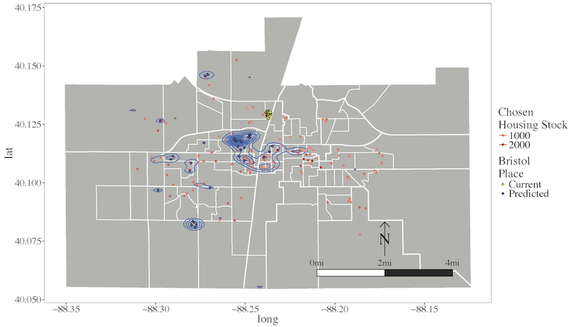

--- 
title: "R como herramienta para la Economía Regional y Urbana" 
author: "Esteban Lopez, Prof. Escuela de Negocios UAI" 
date: "23.11.17" 
mode: selfcontained 
output: 
  slidy_presentation: 
    incremental: false 
    logo: logo.JPG
    highlight: pygments
    footer: "Centro de Economía y Política Regional - twitter: @CEPR_UAI"
---

##¿Qué es la Economía Regional y Urbana? {.flexbox .vcenter}



## Hechos Estilizados Situación actual

> - La población se concentra, ¿Porqué? 
> - Algunas regiones están más desarroladas que otras 
> - Los precios de algunos productos cuestan más caros en algunas ciudades más que en otras 
> - Hoy en día, el éxito de una persona en Chile depende de donde nace.

*** 
Chile y su población 
```{r,echo=FALSE, message=FALSE, warning=FALSE} 
library(leaflet) 
library(maptools) 
path<-"/Users/estebanlopez/Dropbox/Documents/005 Teaching/005 Taller R UAI/2018/Lanzamiento/" 
proj.CL<- "+proj=longlat +datum=WGS84 +no_defs" 
map0<-readShapePoly(paste0(path,"/Mapas/regiones_chile/regiones_chile.shp"),proj4string
= CRS(as.character(proj.CL)))

colors <- sort(heat.colors(5, alpha = 0.8),decreasing = T) 
MP.Palette <-colorNumeric(palette = colors, domain=map0@data$POP_ADMIN) 
regCL.popup <-paste0("<b>Región: ", map0@data$ADMIN_NAME, "</b><br />Población 2010: ",
map0@data$POP_ADMIN)

leaflet(map0) %>% 
  addProviderTiles("OpenStreetMap.BlackAndWhite") %>% 
  addPolygons(stroke=TRUE, 
              weight=1, 
              smoothFactor = 0.4, 
              fillOpacity = .8, 
              popup=regCL.popup, 
              color= ~MP.Palette(map0@data$POP_ADMIN) ) %>% 
addLegend("bottomleft",pal=MP.Palette,values=~POP_ADMIN) 
```

*** 
Chile Deformado por Población 
```{r,echo=FALSE, message=FALSE, warning=FALSE} 
library(leaflet) 
library(maptools) 
path<-"/Users/estebanlopez/Dropbox/Documents/005 Teaching/005 Taller R UAI/2018/Lanzamiento/" 
proj.CL<- "+proj=longlat +datum=WGS84 +no_defs" 
map1<-readShapePoly(paste0(path,"/Mapas/regiones_chile_deformPOP.shp"),proj4string
= CRS(as.character(proj.CL)))

colors <- sort(heat.colors(5, alpha = 0.8),decreasing = T) 
MP.Palette <-colorNumeric(palette = colors, domain=map1@data$POP_ADMIN) 
regCL.popup <- paste0("<b>Región: ", map1@data$ADMIN_NAME, "</b><br />Población 2010: ",
map1@data$POP_ADMIN)

leaflet(map1) %>% 
  addProviderTiles("OpenStreetMap.BlackAndWhite") %>% 
  addPolygons(stroke=TRUE, 
              weight=1, 
              smoothFactor = 0.4, 
              fillOpacity = .8, 
              popup=regCL.popup, 
              color= ~MP.Palette(map1@data$POP_ADMIN) ) %>% 
addLegend("bottomleft",pal=MP.Palette,values=~POP_ADMIN) 
```

*** 
Pero también:...

> - Estamos en la era de la información 
> - Tenemos más recursos que nunca 
> - Cambio en el paradigma dominante hacia mirar más el detalle 
> - Ejemplos:

*** 
##www.ide.cl 
<iframe src="websites/IDE-Chile.html" height='600px' width ='1100px' sandbox='allow-top-'></iframe>

*** 
##www.ine.cl 
<iframe src="websites/INE.html" height='600px' width ='1100px' sandbox='allow-top-'></iframe>


***
## Investigación Regional y Urbana - **_¿Qué hacemos?_**
R Package: GoogleDataSearch



***
R Package: GoogleDataSearch




***
Estadísticas de Empleo

```{r,echo=FALSE,message=FALSE, warning=FALSE}
####### Labor Market Graphs - UAI 2017 - For MILENIO - 20.10.17
library(foreign)
library(data.table)
library(ggplot2)
library(plotly)

path<-"/Users/estebanlopez/Dropbox/Documents/005 Teaching/005 Taller R UAI/2018/Lanzamiento/"
pathD<-paste0(path,"data/")

BB<-data.table(read.csv(paste0(pathD,"AnnualEmploymentxREGIONSEXO_90-15.csv"),header = T))

#c(15,1:5,13,6:9,14,10:12)
BB$REGION<-as.numeric(BB$REGION)
BB$REGION<-factor(BB$REGION,levels = seq(1,15,1),labels = c("Tarapacá","Antofagasta","Atacama","La Serena","Valparaiso","O'Higgings","Maule","BioBio","Araucania","Los Lagos","Aysén","Magallanes","R.M.","Los Ríos","Arica y Parinacota"))
BB$REGION<-factor(BB$REGION,levels(BB$REGION)[c(12:10,14,9:6,13,5:1,15)])
#BB$REGION<-factor(BB$REGION,levels(BB$REGION)[c(15,1:5,13,6:9,14,10:12)])
BB$SEXO<-factor(BB$SEXO,levels = 1:2,labels = c("Male","Female") )
BB$Year<-factor(BB$Year,levels = 1990:2015,labels = paste(1990:2015))

#Distribution Plots
dd<-ggplot(aes(x=REGION,y=AnunalAverage),data=BB[Variable=="Employment.Share" & Year%in%c("1990","2000","2010","2015"),])
dd <- dd + geom_bar(stat = 'identity', position = position_dodge(width=0.5),width = 0.8) + coord_flip(ylim = c(0.2,0.8))
dd<- dd + facet_grid(SEXO~Year) + labs(title="Percent of Employed",subtitle="From the total population in Working age - by Regions and Selected Years",y="Annual Average",x="Region")
dd
```


***
Modelos de Decisión Residencial




## Nos queda mucho por hacer!


Proyectos:

> - Completar la página web del CEPR
> - Desarrollar más investigación en Educación y Espacio
> - Entrenar talento jóven para la siguiente generación.


